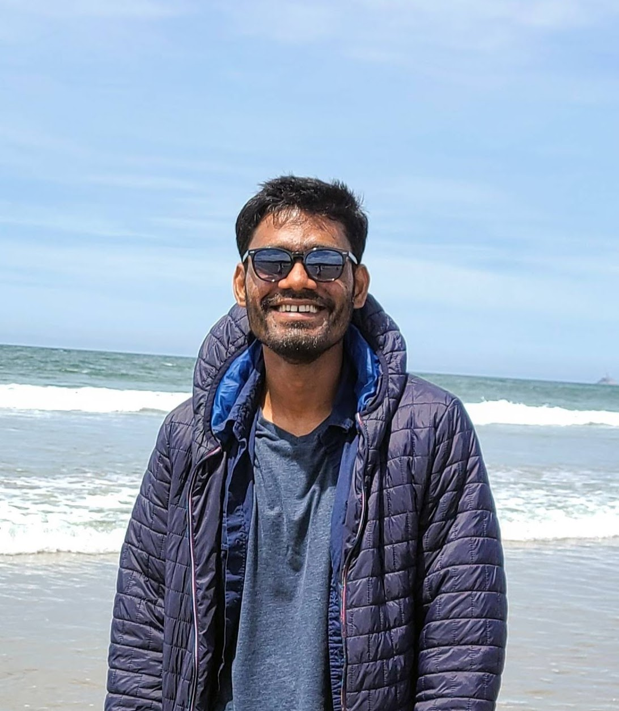

 

<name> Ramesh Kumar Sah </name>

Hi, I am a PhD student at <a href="http://epsl.eecs.wsu.edu/"> Embedded and Pervasive System Lab </a>, part of the <a href="https://school.eecs.wsu.edu/"> School of 
Electrical Engineering and Computer Science </a> at <a href="https://wsu.edu/"> Washington State University </a>, 
where I work on Adversarial Machine Learning and Ubiquitous Computing.

From 2016 to 2018, I worked at <a href="https://rts.com.np/"> Real Time Solutions Pvt. Ltd </a>, as part of the research and
development team as a Firmware Design Engineer. I primarily designed and wrote firmwares for various products
like remote communication modules, smoke detector, queue management systems etc.

I have a Bachelor of Engineering with focus on Electronics and Communication from <a href="https://www.ku.edu.np/"> Kathmandu University </a>
, Nepal. For more details about me please either check out my <a href="https://www.linkedin.com/in/rameshkrsah/"> LinkedIn profile </a> or my <a href="../assets/files/cv_2019.pdf">
CV </a>.

## Cheers !!
