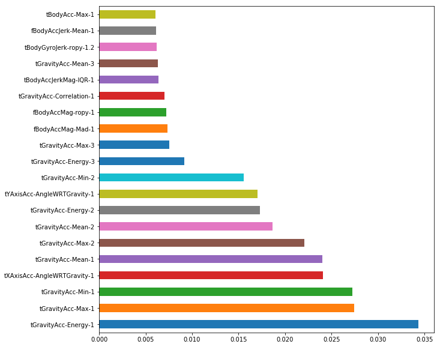

# Feature Selection
Very often we find ourselves with feature vectors with large number of components. It is a general understanding and well received one that large number of features is very often a bad idea. Thus we should in most try to reduce the number of features we have in the dataset. Lesser number features can help understand the relationship between the input and output better and give less complicated model which require less resources to run.


```python
from __future__ import absolute_import
from __future__ import division
from __future__ import print_function
from __future__ import unicode_literals
```


```python
import math
import numpy as np
import pandas as pd
import pickle
import matplotlib.pyplot as plt
import os
```

# Dataset
The dataset we will be using is the HAPT data from UCI repository. It's a Human Activity Recognition Dataset, which consists of 561 features 7767 train samples and 3162 test samples. The feature values are normalized between -1 and 1.


```python
file = open("Saved Data/HAPT_Feature_Data.pickle", 'rb')
x_train, y_train, x_test, y_test = pickle.load(file)
file.close()
```


```python
x_train.describe()
```


<div>
<style scoped>
    .dataframe tbody tr th:only-of-type {
        vertical-align: middle;
    }

    .dataframe tbody tr th {
        vertical-align: top;
    }

    .dataframe thead th {
        text-align: right;
    }
</style>
<table border="1" class="dataframe">
  <thead>
    <tr style="text-align: right;">
      <th></th>
      <th>tBodyAcc-Mean-1</th>
      <th>tBodyAcc-Mean-2</th>
      <th>tBodyAcc-Mean-3</th>
      <th>tBodyAcc-STD-1</th>
      <th>tBodyAcc-STD-2</th>
      <th>tBodyAcc-STD-3</th>
      <th>tBodyAcc-Mad-1</th>
      <th>tBodyAcc-Mad-2</th>
      <th>tBodyAcc-Mad-3</th>
      <th>tBodyAcc-Max-1</th>
      <th>...</th>
      <th>fBodyGyroJerkMag-MeanFreq-1</th>
      <th>fBodyGyroJerkMag-Skewness-1</th>
      <th>fBodyGyroJerkMag-Kurtosis-1</th>
      <th>tBodyAcc-AngleWRTGravity-1</th>
      <th>tBodyAccJerk-AngleWRTGravity-1</th>
      <th>tBodyGyro-AngleWRTGravity-1</th>
      <th>tBodyGyroJerk-AngleWRTGravity-1</th>
      <th>tXAxisAcc-AngleWRTGravity-1</th>
      <th>tYAxisAcc-AngleWRTGravity-1</th>
      <th>tZAxisAcc-AngleWRTGravity-1</th>
    </tr>
  </thead>
  <tbody>
    <tr>
      <th>count</th>
      <td>7767.000000</td>
      <td>7767.000000</td>
      <td>7767.000000</td>
      <td>7767.000000</td>
      <td>7767.000000</td>
      <td>7767.000000</td>
      <td>7767.000000</td>
      <td>7767.000000</td>
      <td>7767.000000</td>
      <td>7767.000000</td>
      <td>...</td>
      <td>7767.000000</td>
      <td>7767.000000</td>
      <td>7767.000000</td>
      <td>7767.000000</td>
      <td>7767.000000</td>
      <td>7767.000000</td>
      <td>7767.000000</td>
      <td>7767.000000</td>
      <td>7767.000000</td>
      <td>7767.000000</td>
    </tr>
    <tr>
      <th>mean</th>
      <td>0.038759</td>
      <td>-0.000647</td>
      <td>-0.018155</td>
      <td>-0.599017</td>
      <td>-0.634424</td>
      <td>-0.691270</td>
      <td>-0.623886</td>
      <td>-0.657884</td>
      <td>-0.740154</td>
      <td>-0.360200</td>
      <td>...</td>
      <td>0.161745</td>
      <td>-0.316548</td>
      <td>-0.625132</td>
      <td>0.016774</td>
      <td>0.018471</td>
      <td>0.009239</td>
      <td>-0.005184</td>
      <td>-0.485936</td>
      <td>0.050310</td>
      <td>-0.052888</td>
    </tr>
    <tr>
      <th>std</th>
      <td>0.101996</td>
      <td>0.099974</td>
      <td>0.089927</td>
      <td>0.441481</td>
      <td>0.367558</td>
      <td>0.321641</td>
      <td>0.418113</td>
      <td>0.348005</td>
      <td>0.272619</td>
      <td>0.499259</td>
      <td>...</td>
      <td>0.237319</td>
      <td>0.313899</td>
      <td>0.302581</td>
      <td>0.331326</td>
      <td>0.443540</td>
      <td>0.601208</td>
      <td>0.477218</td>
      <td>0.509278</td>
      <td>0.300866</td>
      <td>0.276196</td>
    </tr>
    <tr>
      <th>min</th>
      <td>-1.000000</td>
      <td>-1.000000</td>
      <td>-1.000000</td>
      <td>-1.000000</td>
      <td>-1.000000</td>
      <td>-1.000000</td>
      <td>-1.000000</td>
      <td>-1.000000</td>
      <td>-1.000000</td>
      <td>-1.000000</td>
      <td>...</td>
      <td>-0.958535</td>
      <td>-1.000000</td>
      <td>-1.000000</td>
      <td>-0.976580</td>
      <td>-1.000000</td>
      <td>-1.000000</td>
      <td>-1.000000</td>
      <td>-1.000000</td>
      <td>-1.000000</td>
      <td>-0.987874</td>
    </tr>
    <tr>
      <th>25%</th>
      <td>0.032037</td>
      <td>-0.011209</td>
      <td>-0.028448</td>
      <td>-0.992140</td>
      <td>-0.983570</td>
      <td>-0.984661</td>
      <td>-0.992902</td>
      <td>-0.984131</td>
      <td>-0.986661</td>
      <td>-0.795613</td>
      <td>...</td>
      <td>0.020312</td>
      <td>-0.548129</td>
      <td>-0.843966</td>
      <td>-0.108225</td>
      <td>-0.261002</td>
      <td>-0.470267</td>
      <td>-0.373565</td>
      <td>-0.810953</td>
      <td>-0.047752</td>
      <td>-0.140560</td>
    </tr>
    <tr>
      <th>50%</th>
      <td>0.038975</td>
      <td>-0.002921</td>
      <td>-0.019602</td>
      <td>-0.914202</td>
      <td>-0.827970</td>
      <td>-0.827696</td>
      <td>-0.924421</td>
      <td>-0.838559</td>
      <td>-0.852735</td>
      <td>-0.717007</td>
      <td>...</td>
      <td>0.170819</td>
      <td>-0.353980</td>
      <td>-0.710071</td>
      <td>0.017627</td>
      <td>0.029079</td>
      <td>0.001515</td>
      <td>-0.005503</td>
      <td>-0.706619</td>
      <td>0.176777</td>
      <td>0.004583</td>
    </tr>
    <tr>
      <th>75%</th>
      <td>0.044000</td>
      <td>0.004303</td>
      <td>-0.011676</td>
      <td>-0.246026</td>
      <td>-0.313069</td>
      <td>-0.450478</td>
      <td>-0.294903</td>
      <td>-0.362671</td>
      <td>-0.540521</td>
      <td>0.054178</td>
      <td>...</td>
      <td>0.316240</td>
      <td>-0.137462</td>
      <td>-0.503837</td>
      <td>0.167695</td>
      <td>0.314876</td>
      <td>0.496871</td>
      <td>0.352690</td>
      <td>-0.488765</td>
      <td>0.246834</td>
      <td>0.109507</td>
    </tr>
    <tr>
      <th>max</th>
      <td>1.000000</td>
      <td>1.000000</td>
      <td>1.000000</td>
      <td>1.000000</td>
      <td>0.945956</td>
      <td>1.000000</td>
      <td>1.000000</td>
      <td>0.960341</td>
      <td>1.000000</td>
      <td>1.000000</td>
      <td>...</td>
      <td>1.000000</td>
      <td>0.938491</td>
      <td>0.911653</td>
      <td>1.000000</td>
      <td>1.000000</td>
      <td>0.998702</td>
      <td>0.991288</td>
      <td>1.000000</td>
      <td>0.482229</td>
      <td>1.000000</td>
    </tr>
  </tbody>
</table>
<p>8 rows × 561 columns</p>
</div>


```python
x_test.describe()
```


<div>
<style scoped>
    .dataframe tbody tr th:only-of-type {
        vertical-align: middle;
    }

    .dataframe tbody tr th {
        vertical-align: top;
    }

    .dataframe thead th {
        text-align: right;
    }
</style>
<table border="1" class="dataframe">
  <thead>
    <tr style="text-align: right;">
      <th></th>
      <th>tBodyAcc-Mean-1</th>
      <th>tBodyAcc-Mean-2</th>
      <th>tBodyAcc-Mean-3</th>
      <th>tBodyAcc-STD-1</th>
      <th>tBodyAcc-STD-2</th>
      <th>tBodyAcc-STD-3</th>
      <th>tBodyAcc-Mad-1</th>
      <th>tBodyAcc-Mad-2</th>
      <th>tBodyAcc-Mad-3</th>
      <th>tBodyAcc-Max-1</th>
      <th>...</th>
      <th>fBodyGyroJerkMag-MeanFreq-1</th>
      <th>fBodyGyroJerkMag-Skewness-1</th>
      <th>fBodyGyroJerkMag-Kurtosis-1</th>
      <th>tBodyAcc-AngleWRTGravity-1</th>
      <th>tBodyAccJerk-AngleWRTGravity-1</th>
      <th>tBodyGyro-AngleWRTGravity-1</th>
      <th>tBodyGyroJerk-AngleWRTGravity-1</th>
      <th>tXAxisAcc-AngleWRTGravity-1</th>
      <th>tYAxisAcc-AngleWRTGravity-1</th>
      <th>tZAxisAcc-AngleWRTGravity-1</th>
    </tr>
  </thead>
  <tbody>
    <tr>
      <th>count</th>
      <td>3162.000000</td>
      <td>3162.000000</td>
      <td>3162.000000</td>
      <td>3162.000000</td>
      <td>3162.000000</td>
      <td>3162.000000</td>
      <td>3162.000000</td>
      <td>3162.000000</td>
      <td>3162.000000</td>
      <td>3162.000000</td>
      <td>...</td>
      <td>3162.000000</td>
      <td>3162.000000</td>
      <td>3162.000000</td>
      <td>3162.000000</td>
      <td>3162.000000</td>
      <td>3162.000000</td>
      <td>3162.000000</td>
      <td>3162.000000</td>
      <td>3162.000000</td>
      <td>3162.000000</td>
    </tr>
    <tr>
      <th>mean</th>
      <td>0.040530</td>
      <td>-0.001695</td>
      <td>-0.019453</td>
      <td>-0.609770</td>
      <td>-0.631731</td>
      <td>-0.711263</td>
      <td>-0.636741</td>
      <td>-0.654112</td>
      <td>-0.758061</td>
      <td>-0.358429</td>
      <td>...</td>
      <td>0.162821</td>
      <td>-0.284730</td>
      <td>-0.595537</td>
      <td>0.015090</td>
      <td>0.021202</td>
      <td>0.043183</td>
      <td>-0.020684</td>
      <td>-0.511371</td>
      <td>0.067774</td>
      <td>-0.045618</td>
    </tr>
    <tr>
      <th>std</th>
      <td>0.101559</td>
      <td>0.102384</td>
      <td>0.083897</td>
      <td>0.405103</td>
      <td>0.360294</td>
      <td>0.284112</td>
      <td>0.379665</td>
      <td>0.342661</td>
      <td>0.241093</td>
      <td>0.479339</td>
      <td>...</td>
      <td>0.221286</td>
      <td>0.313079</td>
      <td>0.309507</td>
      <td>0.329827</td>
      <td>0.442320</td>
      <td>0.626639</td>
      <td>0.501336</td>
      <td>0.506231</td>
      <td>0.326118</td>
      <td>0.239647</td>
    </tr>
    <tr>
      <th>min</th>
      <td>-0.751552</td>
      <td>-0.962639</td>
      <td>-0.814359</td>
      <td>-0.999715</td>
      <td>-0.999611</td>
      <td>-0.999911</td>
      <td>-0.999274</td>
      <td>-0.999319</td>
      <td>-0.999505</td>
      <td>-0.893297</td>
      <td>...</td>
      <td>-1.000000</td>
      <td>-0.997185</td>
      <td>-0.985065</td>
      <td>-1.000000</td>
      <td>-0.993402</td>
      <td>-0.998898</td>
      <td>-0.990616</td>
      <td>-0.983811</td>
      <td>-0.914248</td>
      <td>-1.000000</td>
    </tr>
    <tr>
      <th>25%</th>
      <td>0.031544</td>
      <td>-0.011462</td>
      <td>-0.028986</td>
      <td>-0.990017</td>
      <td>-0.979300</td>
      <td>-0.981256</td>
      <td>-0.991374</td>
      <td>-0.980940</td>
      <td>-0.983562</td>
      <td>-0.793628</td>
      <td>...</td>
      <td>0.029500</td>
      <td>-0.522444</td>
      <td>-0.828862</td>
      <td>-0.111039</td>
      <td>-0.252667</td>
      <td>-0.493294</td>
      <td>-0.438279</td>
      <td>-0.828871</td>
      <td>-0.007741</td>
      <td>-0.096185</td>
    </tr>
    <tr>
      <th>50%</th>
      <td>0.038861</td>
      <td>-0.002700</td>
      <td>-0.019488</td>
      <td>-0.807078</td>
      <td>-0.686914</td>
      <td>-0.738534</td>
      <td>-0.828256</td>
      <td>-0.707638</td>
      <td>-0.778504</td>
      <td>-0.673711</td>
      <td>...</td>
      <td>0.176792</td>
      <td>-0.322259</td>
      <td>-0.681600</td>
      <td>0.013685</td>
      <td>0.032937</td>
      <td>0.043555</td>
      <td>-0.022624</td>
      <td>-0.728029</td>
      <td>0.175138</td>
      <td>-0.005486</td>
    </tr>
    <tr>
      <th>75%</th>
      <td>0.043751</td>
      <td>0.005224</td>
      <td>-0.011233</td>
      <td>-0.270904</td>
      <td>-0.358639</td>
      <td>-0.487716</td>
      <td>-0.324933</td>
      <td>-0.403433</td>
      <td>-0.578883</td>
      <td>0.052758</td>
      <td>...</td>
      <td>0.313719</td>
      <td>-0.095637</td>
      <td>-0.452381</td>
      <td>0.161560</td>
      <td>0.316195</td>
      <td>0.609499</td>
      <td>0.387438</td>
      <td>-0.528704</td>
      <td>0.257544</td>
      <td>0.094051</td>
    </tr>
    <tr>
      <th>max</th>
      <td>0.976950</td>
      <td>0.989925</td>
      <td>0.766017</td>
      <td>0.465271</td>
      <td>1.000000</td>
      <td>0.848957</td>
      <td>0.439686</td>
      <td>1.000000</td>
      <td>0.689027</td>
      <td>0.909166</td>
      <td>...</td>
      <td>0.984200</td>
      <td>1.000000</td>
      <td>1.000000</td>
      <td>0.998898</td>
      <td>0.986347</td>
      <td>1.000000</td>
      <td>1.000000</td>
      <td>0.829446</td>
      <td>1.000000</td>
      <td>0.972160</td>
    </tr>
  </tbody>
</table>
<p>8 rows × 561 columns</p>
</div>


```python
# converting the dataframes into numpy arrays
y_train = y_train.values
y_test = y_test.values
```

# Univariate Selection 
In univariate selection we use different statistical measures to measure the correlation between two variables. Here we measure the correlation between the features and the class labels. The most correlated features are marked by rank. The scikit-learn library provides the SelectKBest class that can be used with a suite of different statistical tests to select a specific number of features.


```python
from sklearn.feature_selection import SelectKBest
from sklearn.feature_selection import chi2, f_classif, mutual_info_classif
'''
The available scoring functions are 
For regression: f_regression, mutual_info_regression
For classification: chi2, f_classif, mutual_info_classif 

For chi2 measure the feature values must be non-negative

The methods based on F-test estimate the degree of linear dependency between two random
variables. On the other hand, mutual information methods can capture any kind of statistical
dependency, but they require more samples for accurate estimation.

Using a regression scoring function with a classification problem, we give useless
results.
'''

print("Before data shape {}".format(x_train.shape))

k_select = SelectKBest(f_classif, k=200)
k_fit = k_select.fit(x_train, y_train)

k_scores = pd.DataFrame(k_fit.scores_)
k_columns = pd.DataFrame(x_train.columns)

# concatenate the two dataframes
k_feature_scores = pd.concat([k_columns, k_scores], axis=1)
k_feature_scores.columns = ['Features', 'Score']

```

    Before data shape (7767, 561)
    

    C:\Users\rames\Anaconda3\lib\site-packages\sklearn\utils\validation.py:578: DataConversionWarning: A column-vector y was passed when a 1d array was expected. Please change the shape of y to (n_samples, ), for example using ravel().
      y = column_or_1d(y, warn=True)
    


```python
# print the 50 best featurs for mutual_information measure, just change the 
# f_classify with mutual_info_classif
print(k_feature_scores.nlargest(50, 'Score'))
```

                               Features     Score
    9                    tBodyAcc-Max-1  1.040566
    89               tBodyAccJerk-Max-1  0.989803
    381   fBodyAccJerk-BandsEnergyOld-1  0.963095
    53                tGravityAcc-Min-2  0.948072
    389   fBodyAccJerk-BandsEnergyOld-9  0.947161
    50                tGravityAcc-Max-2  0.938974
    90               tBodyAccJerk-Max-2  0.925289
    229           tBodyAccJerkMag-Max-1  0.923134
    271                  fBodyAcc-Mad-1  0.921421
    92               tBodyAccJerk-Min-1  0.912167
    310       fBodyAcc-BandsEnergyOld-9  0.911884
    268                  fBodyAcc-STD-1  0.909825
    393  fBodyAccJerk-BandsEnergyOld-13  0.909533
    203               tBodyAccMag-Max-1  0.908645
    216            tGravityAccMag-Max-1  0.908645
    314      fBodyAcc-BandsEnergyOld-13  0.907935
    12                   tBodyAcc-Min-1  0.905583
    3                    tBodyAcc-STD-1  0.904722
    281               fBodyAcc-Energy-1  0.904376
    302       fBodyAcc-BandsEnergyOld-1  0.900154
    265                 fBodyAcc-Mean-1  0.896168
    16                tBodyAcc-Energy-1  0.895885
    83               tBodyAccJerk-STD-1  0.895730
    360           fBodyAccJerk-Energy-1  0.895420
    93               tBodyAccJerk-Min-2  0.893954
    171             tBodyGyroJerk-Max-3  0.892226
    96            tBodyAccJerk-Energy-1  0.891629
    6                    tBodyAcc-Mad-1  0.887885
    347              fBodyAccJerk-STD-1  0.886659
    94               tBodyAccJerk-Min-3  0.886502
    174             tBodyGyroJerk-Min-3  0.884669
    86               tBodyAccJerk-Mad-1  0.882345
    344             fBodyAccJerk-Mean-1  0.882204
    287                 fBodyAcc-ropy-1  0.881254
    350              fBodyAccJerk-Mad-1  0.879969
    230           tBodyAccJerkMag-Min-1  0.876834
    233           tBodyAccJerkMag-IQR-1  0.875518
    91               tBodyAccJerk-Max-3  0.874960
    256          tBodyGyroJerkMag-Min-1  0.874171
    255          tBodyGyroJerkMag-Max-1  0.872292
    169             tBodyGyroJerk-Max-1  0.871754
    274                  fBodyAcc-Max-1  0.871643
    234          tBodyAccJerkMag-ropy-1  0.866766
    228           tBodyAccJerkMag-Mad-1  0.866394
    172             tBodyGyroJerk-Min-1  0.865644
    353              fBodyAccJerk-Max-1  0.865535
    503               fBodyAccMag-STD-1  0.864301
    99               tBodyAccJerk-IQR-1  0.863093
    226          tBodyAccJerkMag-Mean-1  0.862525
    231           tBodyAccJerkMag-SMA-1  0.862525
    


```python
# print the 50 best featurs for f_classfiy measure
print(k_feature_scores.nlargest(50, 'Score'))
```

                            Features         Score
    366          fBodyAccJerk-ropy-1  14496.239726
    40            tGravityAcc-Mean-1  12054.131140
    367        fBodyAccJerk-ropy-1.1  11306.825668
    49             tGravityAcc-Max-1  11065.679008
    52             tGravityAcc-Min-1  11031.900335
    56          tGravityAcc-Energy-1  10720.464105
    234       tBodyAccJerkMag-ropy-1   9814.528595
    523       fBodyAccJerkMag-ropy-1   9682.241808
    102          tBodyAccJerk-ropy-1   9523.607692
    287              fBodyAcc-ropy-1   9418.547047
    9                 tBodyAcc-Max-1   8671.414741
    104        tBodyAccJerk-ropy-1.2   8157.204363
    368        fBodyAccJerk-ropy-1.2   8025.484573
    271               fBodyAcc-Mad-1   8024.732276
    103        tBodyAccJerk-ropy-1.1   7942.885584
    3                 tBodyAcc-STD-1   7708.283718
    558  tXAxisAcc-AngleWRTGravity-1   7688.959321
    280               fBodyAcc-SMA-1   7664.668858
    265              fBodyAcc-Mean-1   7271.657144
    268               fBodyAcc-STD-1   6981.717609
    200           tBodyAccMag-Mean-1   6711.954898
    205            tBodyAccMag-SMA-1   6711.954898
    213        tGravityAccMag-Mean-1   6711.954898
    218         tGravityAccMag-SMA-1   6711.954898
    6                 tBodyAcc-Mad-1   6653.273981
    15                tBodyAcc-SMA-1   6642.539739
    288            fBodyAcc-ropy-1.1   6490.443702
    510           fBodyAccMag-ropy-1   6275.685439
    226       tBodyAccJerkMag-Mean-1   6012.889757
    231        tBodyAccJerkMag-SMA-1   6012.889757
    95            tBodyAccJerk-SMA-1   5903.222356
    184       tBodyGyroJerk-ropy-1.2   5880.204260
    228        tBodyAccJerkMag-Mad-1   5800.225498
    359           fBodyAccJerk-SMA-1   5784.397398
    83            tBodyAccJerk-STD-1   5725.835979
    203            tBodyAccMag-Max-1   5704.186208
    216         tGravityAccMag-Max-1   5704.186208
    86            tBodyAccJerk-Mad-1   5695.291359
    289            fBodyAcc-ropy-1.2   5650.141394
    344          fBodyAccJerk-Mean-1   5531.241992
    233        tBodyAccJerkMag-IQR-1   5407.956917
    347           fBodyAccJerk-STD-1   5386.003335
    227        tBodyAccJerkMag-STD-1   5385.158618
    350           fBodyAccJerk-Mad-1   5383.402360
    272               fBodyAcc-Mad-2   5349.873965
    502           fBodyAccMag-Mean-1   5288.676934
    507            fBodyAccMag-SMA-1   5288.676934
    504            fBodyAccMag-Mad-1   5266.209025
    266              fBodyAcc-Mean-2   5262.554965
    87            tBodyAccJerk-Mad-2   5254.592044
    

# Feature Importance
We can also get the importance of each feature from the '''feature_importances_''' or '''coef_'' attributes of any estimators that has it. The features can be considered unimportant and removed, if the corresponding '''coef_''' or '''feature_importances_''' values are below any threshold. We can specify the threshold numerically or use some heruistics to find it. The the Tree based estimaters can be used to compute feature importances with their '''feature_importances_''' attribute.


```python
from sklearn.ensemble import ExtraTreesClassifier
from sklearn.feature_selection import SelectFromModel
```


```python
xtra_clf = ExtraTreesClassifier(n_estimators=100)
xtra_clf.fit(x_train, y_train)
```

    C:\Users\rames\Anaconda3\lib\site-packages\ipykernel_launcher.py:2: DataConversionWarning: A column-vector y was passed when a 1d array was expected. Please change the shape of y to (n_samples,), for example using ravel().
      
    


    ExtraTreesClassifier(bootstrap=False, class_weight=None, criterion='gini',
               max_depth=None, max_features='auto', max_leaf_nodes=None,
               min_impurity_decrease=0.0, min_impurity_split=None,
               min_samples_leaf=1, min_samples_split=2,
               min_weight_fraction_leaf=0.0, n_estimators=100, n_jobs=1,
               oob_score=False, random_state=None, verbose=0, warm_start=False)


```python
# plot the graph of feature importance of the Extra Tree Classifier
xtra_feature_importance = pd.Series(xtra_clf.feature_importances_, index=x_train.columns)
plt.figure(figsize=(10, 10))
xtra_feature_importance.nlargest(20).plot(kind='barh')
plt.show()
```





```python
# let's select the features that are important as per the Extra Tree classifier
select_model = SelectFromModel(xtra_clf, prefit=True)
x_train_xtra = select_model.transform(x_train)
print("After xtra shape {}".format(x_train_xtra.shape))
```

    After xtra shape (7767, 158)
    

# Correlation Matrix with Heatmap
Correlation gives us a measure of how two quantities are related to each other. What we want to here is to discover the correlated features in the dataset. If two features say x_1 and x_2 are highly correleated then we can ignore either one of them as we gain no information using them both to build the model and most probably we may be degrading the model by using them together. Correlation can be positive (i.e., increase x_1 shows increase in x_2) or negative (i.e., increase in x_1 shows decrease in x_2 or vice-versa). 

Heatmap makes it easy to identify which features are correlated to each other. We will use the Seaborn library to show the heat map. Since the original 561 features is very large we will just show the correlation between first 10 features.


```python
import seaborn as sns
```


```python
x_train_heat = x_train.drop(columns=x_train.columns[10:])
```


```python
plt.figure(figsize=(10, 10))
sns.heatmap(x_train_heat.corr(), annot=True, fmt=".2f")
plt.show()
```


From the heatmap we can see that the features tBodyAcc-Mean-1, tBodyAcc-Mean-2 and tBodyAcc-Mean-3 are highly uncorrelated. The features tBodyAcc-Max1 and tBodyAcc-STD-1 are higly correlated with correlation of 0.97. We can use this to select out the uncorrelated featurse and decrease the dimension of the data.
