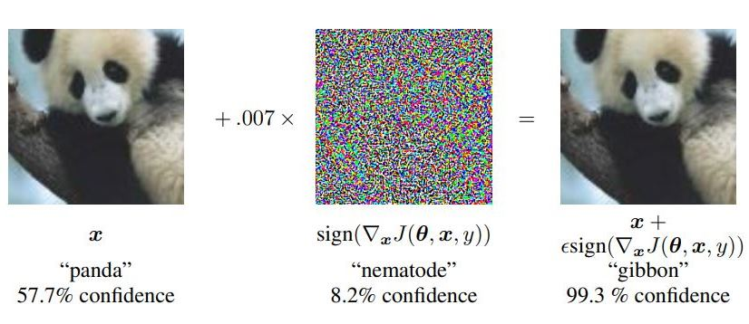
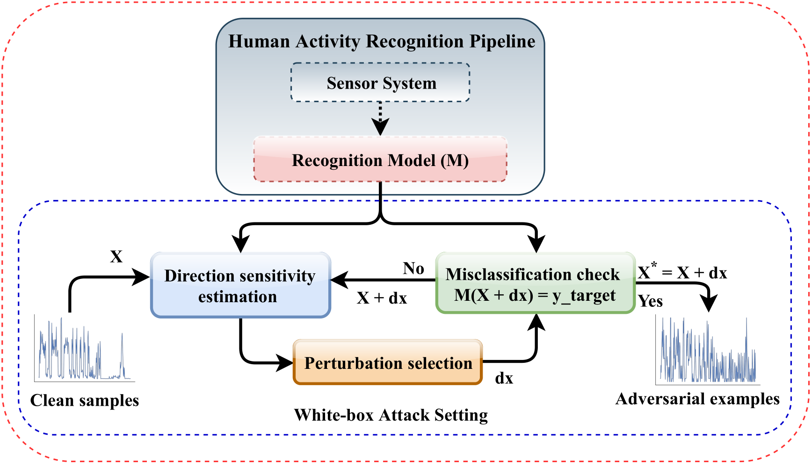
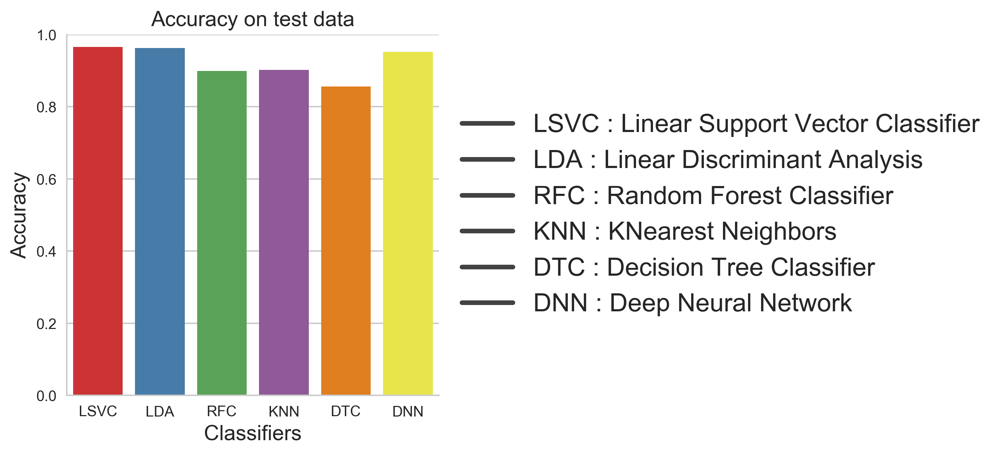
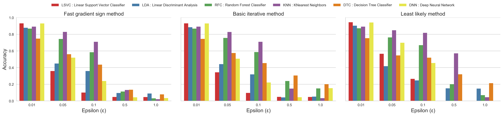
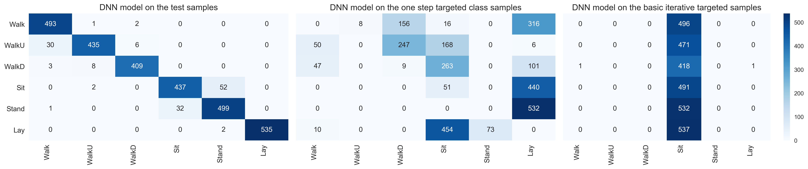
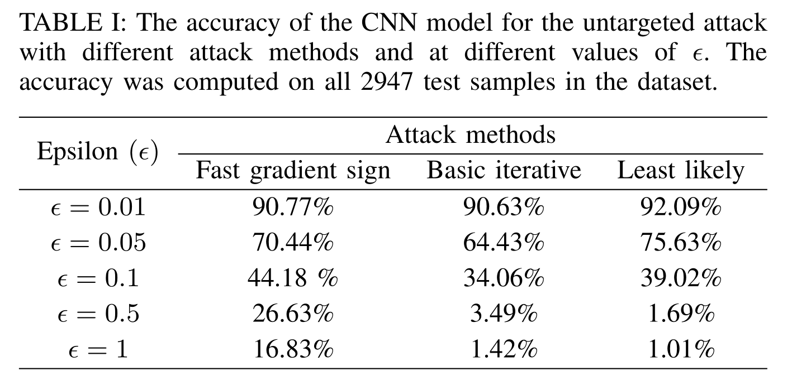
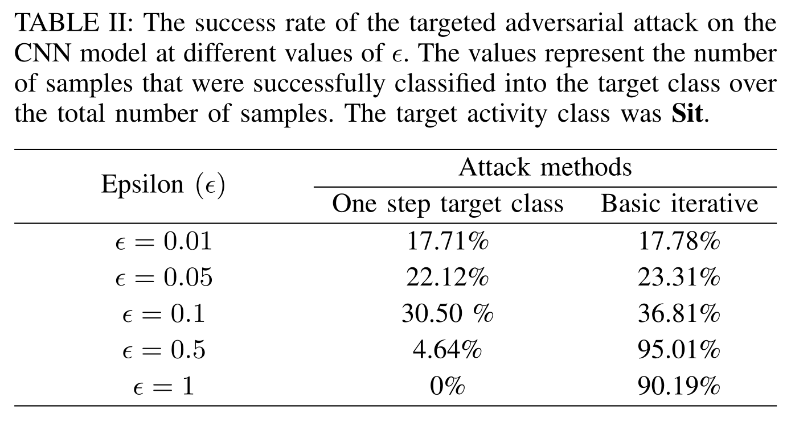

# Adar: Adversarial Activity Recognition in Wearables [Download here](http://epsl.eecs.wsu.edu/wp-content/uploads/2019/10/IEEE_Adar.pdf)

## Introduction, Motivations, and Contributions
This is the accompanying blog post for my paper "Adar: Adversarial Activity Recognition in Wearables", which was
accepted in the 2018 International Conference on Computer Aided Design (ICCAD). In this blog post I will highlight the objective
and motivation for this project and discuss the important results from the experiments. But before we dive in into the
technicalities of the paper, let's first understand the problem at hand.

Human activity recognition (HAR) is a major research area in the field of mobile and ubiquitous computing. In the
recent years we have seen a rise in the adoption of wearables devices that are used to monitor different health markers
such as activity level, diet intake, medicine adherence, etc. Almost all of these devices use one or more machine
learning algorithms to measure these bio-markers and provide information to the user. However, recent studies have found
that machine learning systems which perform very well on inference and prediction tasks are often very vulnerable to
adversarial perturbations. In particular even the addition of a small amount of carefully computed perturbations to the
clean samples degrade the performance of machine learning systems significantly. For example consider the image below,
which is taken from "*Explaining and Harnessing Adversarial Examples*" by **Goodfellow and et. al**. This image shows
that not only the addition of adversarial perturbation to the clean sample is able to fool the classifier but also that
the classifier is more confident in it's incorrect prediction.

 

This result have caused a significant increase in the research work concerning adversarial examples. But mostly these
works are from Computer Vision and Natural Language Processing and there was a gap in research on whether or not
and how activity recognition algorithms may become the subject of adversarial attacks. Human activity recognition shares
many aspects that are common to other areas of Computer Science but it also has its own unique set of challenges and
requires dedicated set of computational methods. For example, the data used to make the inference often comes from a
collection of heterogeneous sensors with different characteristics unlike fixed and well-defined sensing modules such as
as cameras and microphones. Furthermore, unlike other areas where the problem is well defined (e.g., "Is this an image
of a dog?", or "Is the word Harry present in this sentence?"), HAR algorithms need to deal with new challenges due to 
1. complexity of human movements captured from individual body joints and observed partially with wearable sensors
2. lack of concrete definitions, languages, or structure of human activities.

For starter, human activity is highly complex and diverse and the sensor readings for an activity can be very different
even if the activity is performed by the same person under similar conditions compared to, for example, image
classification where an image of a dog is always a dog independent on the presentation and context. Hence, in this paper
we studied the consequences of adversarial examples for activity recognition models and propose an optimization driven
framework called "*Adar*" for generating adversarial examples in wearables systems. The major contributions we made in
this paper are:
1. introduced *Adar* framework for adversarial examples computation for human activity recognition systems,
2. investigated gradient based optimization methods for generating adversarial examples in the context of HAR systems, 
3. compared the robustness of a HAR system towards adversarial examples in feature and signal domain, 
4. evaluated Deep Neural Network (DNN) models trained for HAR on adversarial examples after adversarial training.

## Adar Framework
The figure below shows the Adar framework for computing adversarial examples in HAR systems. This is a general framework
and is based on the white-box attack setting, in which an adversary has complete knowledge of the target system. The
framework has two components: (1) the human activity recognition pipeline, and (2) the gradient based attack in
white-box setting. After the HAR pipeline, the trained model is used to compute adversarial examples using
gradient-based attack methods such as fast gradient sign method, basic iterative method or one step target class method.
Direction sensitivity estimation finds dimensions of inputs *X* that will produce the desired adversarial behaviour with
the smallest perturbation. Perturbation selection used this knowledge to select perturbations \\(\delta\\) affecting sample
*X*'s classification. If the resulting sample \\(X + \delta\\) is misclassified by the model \\(M\\) into the target class
y\_target, an adversarial example \\(X^\*\\) has been found. If not, the steps can be repeated with updated input \\(X +
\delta\\).

 

## Experiments
For the experiments, we have used the UCI [HAPT](https://archive.ics.uci.edu/ml/datasets/human+activity+recognition+using+smartphones) dataset. This dataset was compiled form a group of 30 participants each performing 6 different activities. The sensor data consists of a 3-axial accelerometer and a 3-axial gyroscope sampled at 50 Hz. The sensor readings are segmented into windows of length 2.56 seconds with 50% overlap. The acceleration values are separated into gravity and body components using a Butterworth low pass filter. From each window, 561 features is computed from time and frequency domains.

### Adversarial Examples in Feature Domain
We trained multiple classifiers on the feature data. Figure below shows the accuracy of these classifiers on the test
data. 

 

We can see that most classifiers are performing very well on the test set. In particular Linear Support Vector
Classifier and Deep Neural Network are doing very well. Next we used the trained DNN model to compute adversarial examples using different gradient based attack methods. The performance of all the different trained classifiers was evaluated on the computed adversarial examples. Figure below shows the accuracy levels.

 

We can see the transferability of attack exists and the accuracy of all classifiers decreased with increase in the value
of \\(\epsilon\\). The k-nearest neighbors (KNN) classifier was found to be the most robust among others in all cases.
The is due the nature of KNN classifier which models itself based on the data distribution. Until, now have only shown
the untargeted attack on the machine learning classifiers. For the targeted we choose the *Sit* class as the target
class and computed adversarial examples using the trained DNN model. The confusion matrix of the DNN model for different
attack methods is shown below. It is clear that the one step target class method is more competent at untargeted
misclassification attack than the basic iterative methods, and the basic iterative method is more successful at targeted
misclassification attack. This is due to the fact that one step target method add \\(\epsilon\\)-scaled noise to each
samples whereas the iterative methods exploit much finer perturbations and therefore is able to find perturbations that
causes the classifier to classify an input into a particular class.

 

### Adversarial Examples in Signal Domain
The next step in our experiments was to evaluate a data-driven method used for human activity recognition. One such
method is the Convolutional Neural Network (CNN), in which the CNN learns the features and the classification rules
directly from the raw sensor signal. To evaluate a CNN for adversarial examples, we trained a 1D CNN network on the sensor
signal segments. The table below shows the accuracy of the CNN model on the untargeted adversarial examples. As we can
see, with the increase in the value of \\(\epsilon\\), the classification accuracy of the CNN model decreased which was
expected. The decrease in accuracy for the same value of \\\epsilon\\ is largest for the iterative method. This is again
because the iterative method is better suited to search the model's input space and find perturbations that can fool the
model successfully. The similar pattern follows for the targeted attack as seen in the next table. The table for the
targeted attack shows the success rate of the adversarial examples, which is defined as the ratio of the number of
adversarial examples that are classified into the target class to the total number of samples. One interesting thing to
note here is that at higher values of \\(\epsilon\\) one step target class method performs poorly compared to at lower
values of \\(\epsilon\\). This is because at higher values of \\(\epsilon\\) the input samples are completely destroyed by
the addition of \\(\epsilon\\)-scaled noise. Since the adversarial examples computed for the CNN model is in the signal
domain, we call these adversarial signals.

 

 

Also, since we are now dealing with adversarial signals we can plot these and compare the difference in trends between
the clean samples and adversarial samples. Figure below shows the x-channel of the body acceleration signal at different
values of \\(\epsilon\\) for fast gradient sign method and basic iterative method. We can see that the fast gradient sign
method is just adding \\(\epsilon\\)-scaled noise the clean signal whereas the basic iterative method is following the
signal pattern more closely and the added noise preserves the temporal characteristics of the signal.

 

We also experimented with adversarial training as a defense against adversarial examples in feature domain. We found
that with adversarial training the robustness of the DNN model to adversarial did increased but with decrease in the
performance on the clean samples. You can find more detail about this in the paper.

## Conclusion and Future Works
In this paper, we introduced the Adar computational framework for computing adversarial examples for inertial sensor
based activity recognition systems. We investigated different gradient-based evasion attack methods and showed that even
computationally simple attack methods can significantly degrade the performance of the activity recognition models. 
Our results in this paper have extremely important implications in behavioral medicine and mobile health, where 
detecting human behavior is at the center of clinical interventions. The vulnerability of activity recognition models to
adversarial examples not only jeopardize the validity of behavioral interventions that rely on accurate detection of physical
and behavioral context such as dietary intake, medication adherence, opioid dependence, smoking behavior, hydration
status, and physical activity but also opens up risk points that can have serious impacts on people lives. In this work, we only
scratched the surface studying the consequences of adversarial examples in human activity recognition systems, and there
remains a need to fully understand and define adversarial attacks for HAR systems in a much greater extent. From the
lack of standardization to the nature of the HAR systems, the topic of adversarial example has many facets in activity
recognition models. The results of our work also ask many important questions. Should we consider the CNN model more
suitable for activity recognition acknowledging the fact that the CNN models were more robust compared to DNN models
and also has an advantage of learning features and classifier directly from the sensor data? We also showed the existence of
adversarial signals using CNN models. This opens up newer dimensions in the study of adversarial attacks because the
ability to generate adversarial examples at the raw signal level implies that many other data processing blocks such as 
segmentation and pre-processing are also vulnerable to adversarial attacks. This suggests that the study of adversarial attacks in
the context of sensor-based systems need to extend beyond conventional feature-level attacks. What are ramifications of
adversarial signals and how can we use the information from the adversarial signals to impact the sensor system remains
an open question.
