# Installing Machine Learning Framework(s) with Anaconda and Jupyter 
Usually installing machine learning frameworks such as TensorFlow and PyTorch is bit of a hassle and setting up the
proper environment for development based on these frameworks becomes cumbersome than it should it. Although,
installation pages for TensorFlow and PyTorch are pretty good, they lack the details information one need to setup the
development environment easily with flexibility in mind. In this post, I am going to summarize the process I have used to setup the
development environment for machine learning project. I will try to include all the details I have found though trial
and error while installing these frameworks for myself. 

**1. Install Anaconda**

First and foremost, we will need to install the [Anaconda](https://www.anaconda.com/distribution/) distribution package
manager. Anaconda will helps us setup the development environment very easily and provides a lot of flexibility in terms
of creating and maintaining various virtual environment in our system without breaking any thing. 

Select the proper installer for your system and the Python version you need. I will suggest you to install the latest
Python version, since we can always create virtual environments for older Python version. The setup process is very
simple and similar to other programs. One extra thing with the setup process, is to add the Anaconda to system path.
Select the option for adding anaconda to the system path during the setup process. This will help us a lot later on. 

<p align="center"> 

</p>


After installing the Anaconda manager, you need to activate it. To do this open the Anaconda PowerShell and execute the
command:
```
conda init
```

<p align="center"> 
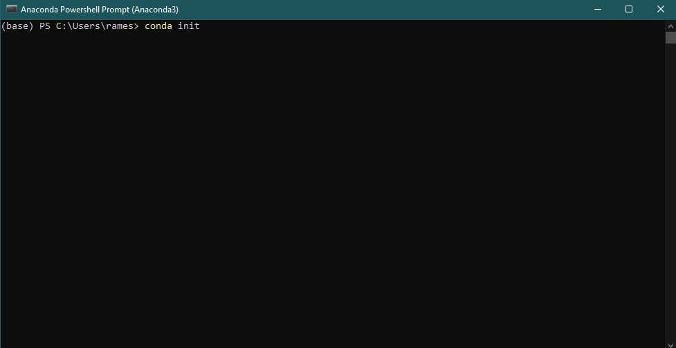
</p>


If you have Git Bash installed, then you can activate conda for Git Bash too so that you can use it from Git Bash. To
activate anaconda for git bash, open Git bash and execute the command:
```
conda init bash
```

<p align="center"> 
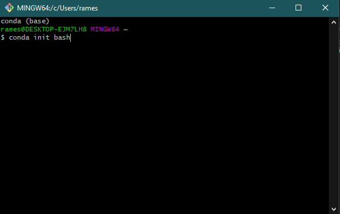
</p>

**2. Setup the Virtual Environment**

The most important feature of Anaconda is that it allows us to create and manage multiple virtual environments. Using
virtual environments we can create development environment for different machine learning frameworks, without affecting
the base Python environment and other virtual environments. 

After a fresh installation of Anaconda, there will be just one environment i.e., the base. List the environments within
you anaconda distribution with the command:
```
conda info --envs
```
Execute this command in the Anaconda PowerShell or Git Bash. I will recommend the PowerShell because it will also show
you the current active environment. By default the base environment will be active.

<p align="center"> 
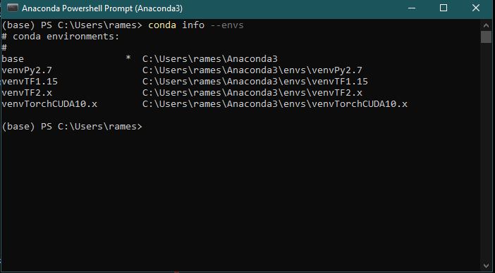
</p>

As you can see, I have 5 environments and I am currently in the base environment.

Say that you want to install the latest version of TensorFlow. To begin, first we will create a new virtual environment
named **testEnv**. Choose the name of the virtual environment based on your requirement, so that it has an informative
name for you. Here, I am creating this environment for demonstration purpose only. 
```
conda create -n testEnv python=3.7
```
Here, I am also specifying the Python version I want to use for this virtual environment.

<p align="center"> 
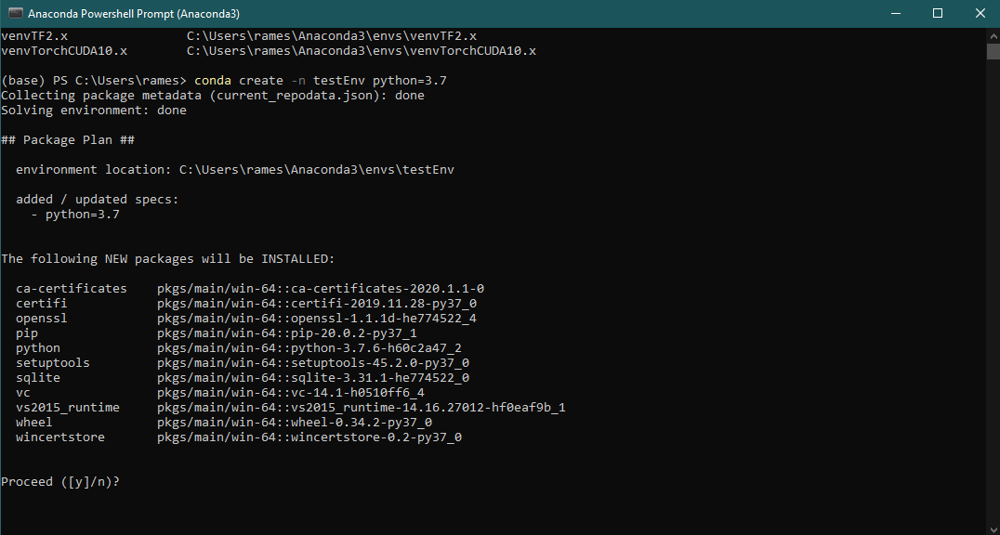
</p>

Press y, when prompted and the environment will be setup for you. Next, before doing anything we need to activate the
virtual environment you just created. 
```
conda activate testEnv
```
Notice that now you are in the activated virtual environment. 

<p align="center"> 
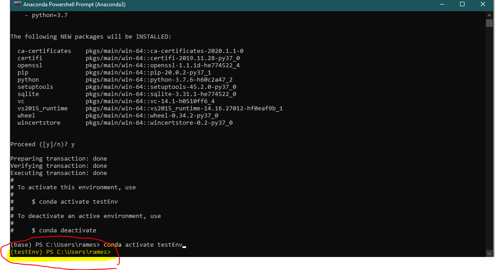
</p>

**3. Install the Machine Learning Framework(s) and other Libraries**
Next install the machine learning framework and libraries that you need. Since, we are using TensorFlow as an example,
I will install the TensorFlow and some other libraries. Install the TensorFlow using *pip*. You may need to upgrade the
*pip*. The install page on TensorFlow website will be useful here. Check it
[out](https://www.tensorflow.org/install/pip).
```
pip install --upgrade tensorflow
```

<p align="center"> 
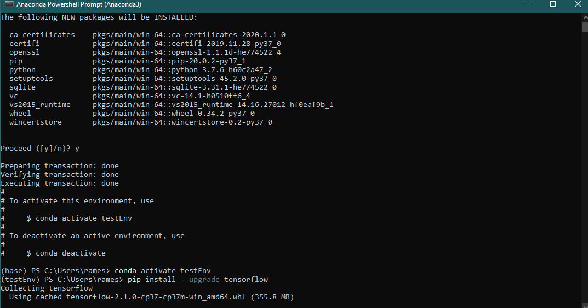
</p>

Once the installation is done, you can install other libraries that you need using *pip*.

**4. Setup the Jupyter Kernel and Notebook**

I think the best way to practice Python is with Jupyter notebook. Jupyter allows us to run codes in blocks and take
notes as we experiments. There are many other benefits of using Jupyter notebook, which I leave upto you to find out :).

To install the jupyter kernel and notebook execute this command:
```
conda install ipykernel jupyter
```
<p align="center"> 
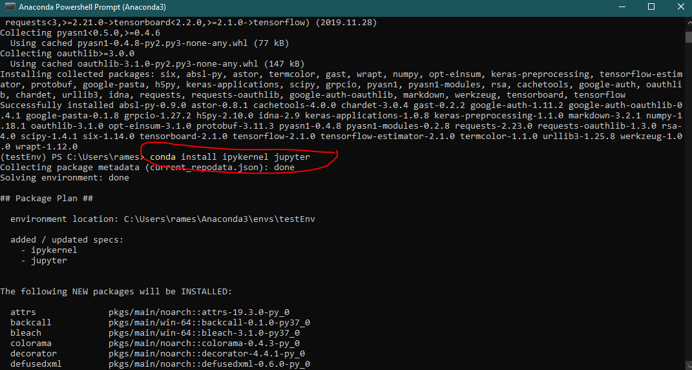
</p>


And, finally create the kernel and give it a name. I will name it **test-Py3-TF-2.x**. Giving an informative name is
again very important, because it will give you the most important information about the kernel when you to select a
kernel among many. 

```
python -m ipykernel install --user --name testEnv --display-name "test-Py3-TF-2.x"
```
Note that you have to give the name of the conda virtual environment you want this kernel to associate with. 

<p align="center"> 
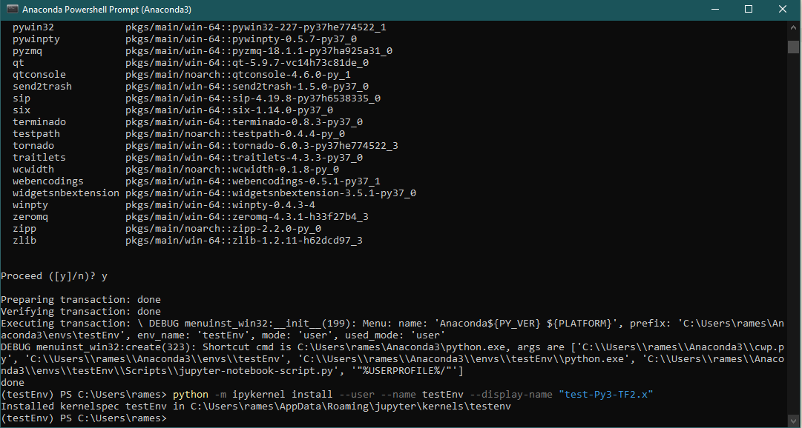
</p>

**5. Last few step ...**

Once you have done everything as listed above in the order, you would have installed the machine framework you wanted to
install. For my case it was the TensorFlow library. Now you are ready to use it in your project. But first, deactivate
the virtual environment and start the jupyter notebook. 
```
conda deactivate
```

<p align="center"> 
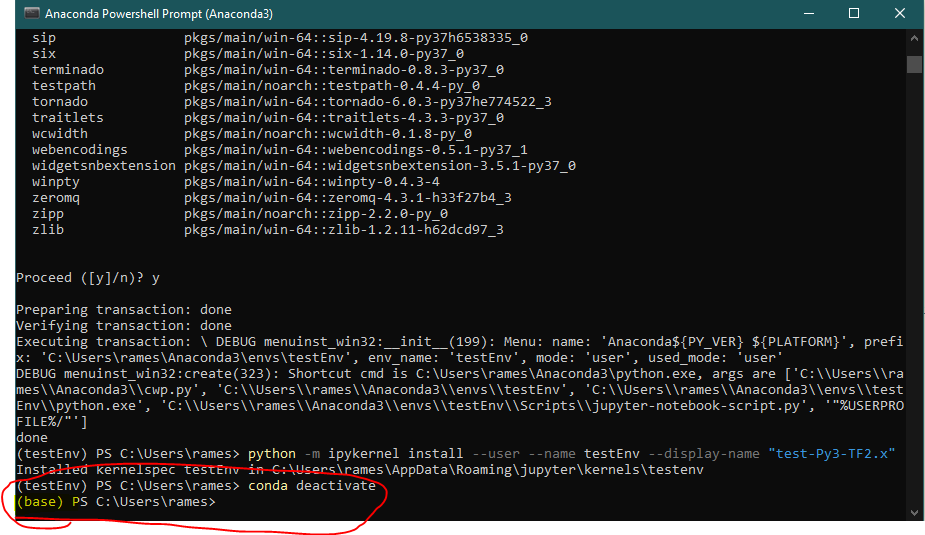
</p>

Note that, you have now returned to the base environment. Let's launch the jupyter notebook.

```
jupyter notebook
```

Create a new notebook and test out the TensorFlow.

<p align="center"> 
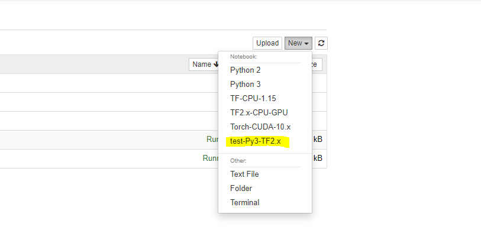
</p>


<p align="center"> 
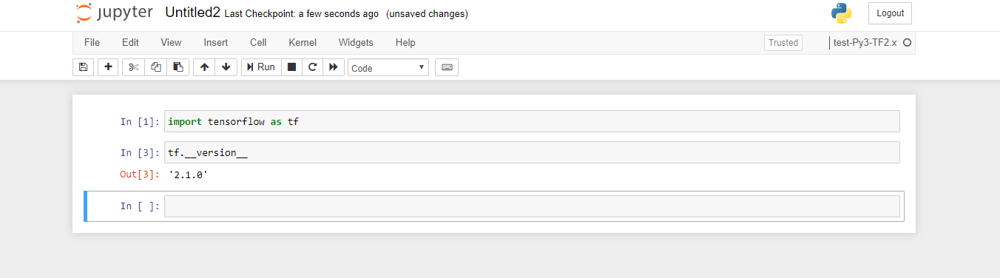
</p>

**6. Finish**

I hope this tutorial helps you setup your development environment and point you in the right direction. I created
this page for reference for me and other people like you. Cheers :) 

**P.S.** To remove the virtual environment, execute the following command with the proper environment name.

```
conda remove -n testEnv --all
```

And after removing the environment, we have the returned to the initial state, where I had 5 environments (your's will
be different)
```
conda info --envs
```

<p align="center"> 
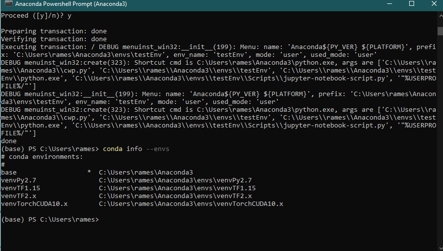
</p>


**Note: Please consult [here](https://www.pugetsystems.com/labs/hpc/How-to-Install-TensorFlow-with-GPU-Support-on-Windows-10-Without-Installing-CUDA-UPDATED-1419/)
for details on how to setup your graphics card**.

