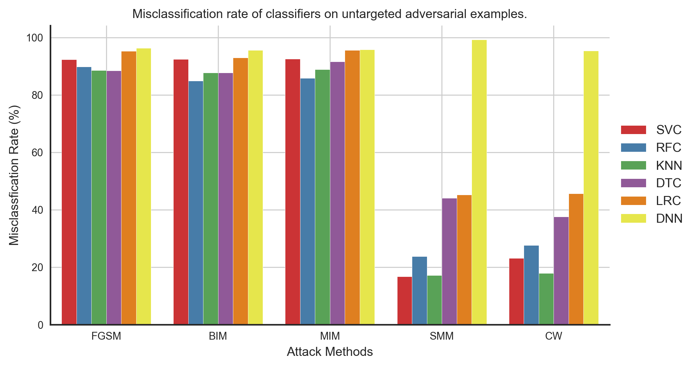
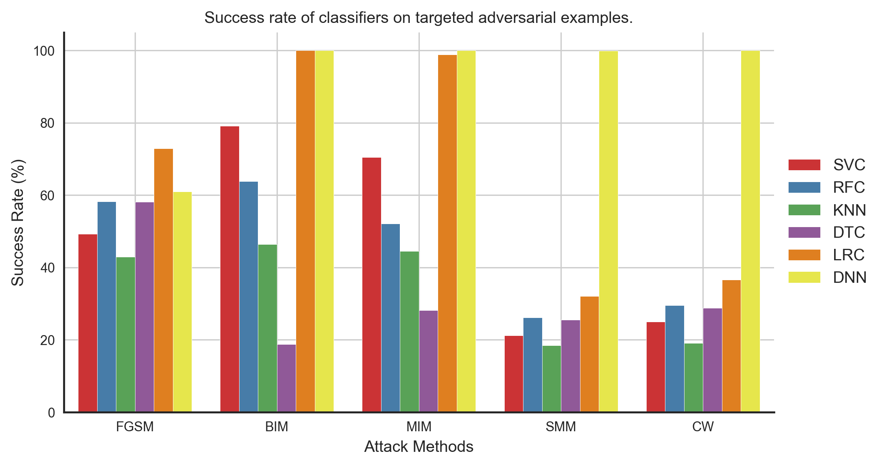
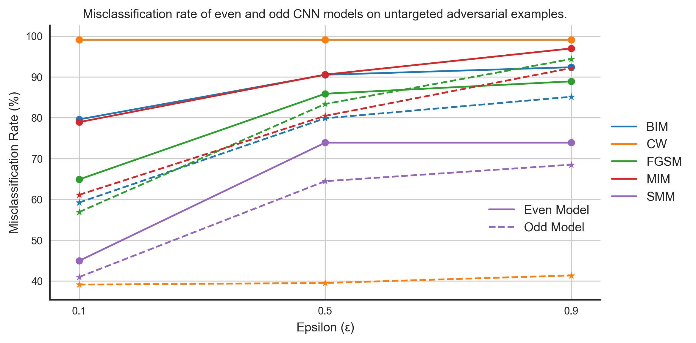
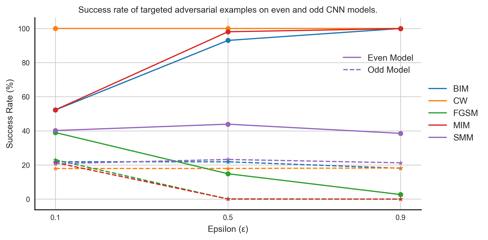
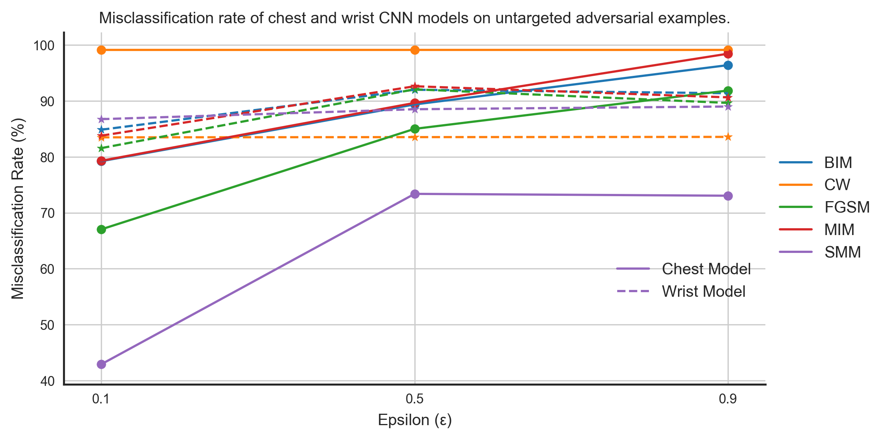
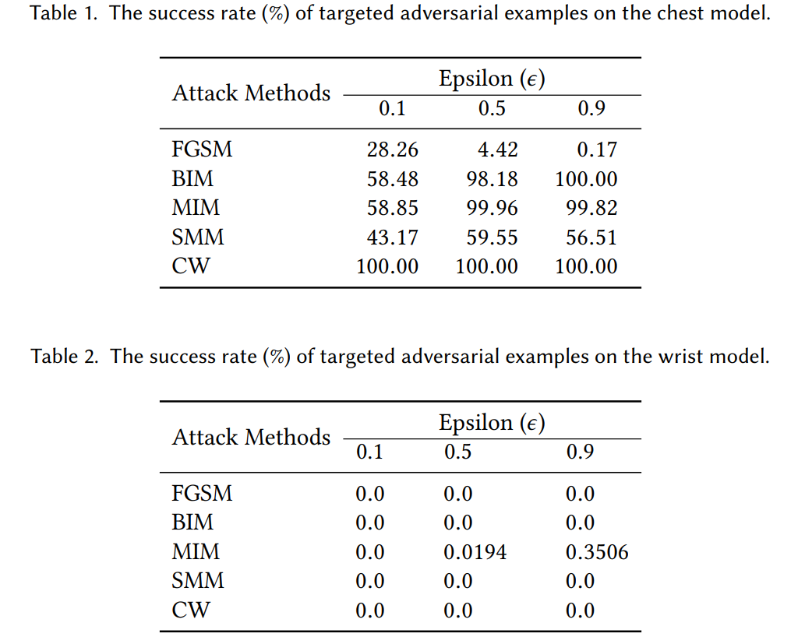
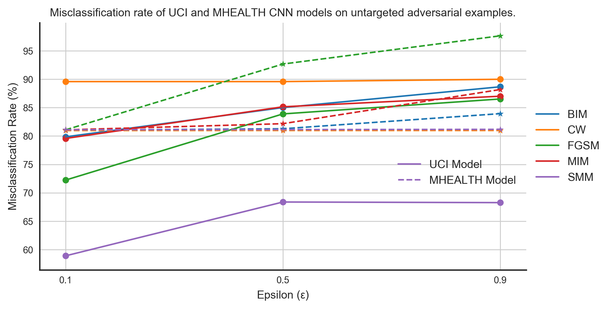
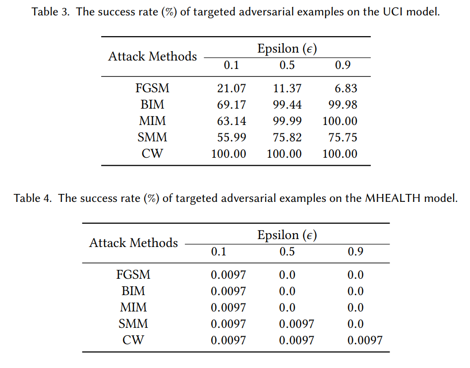

# Introduction
This article is brief summary of our paper on "[Adversarial Transferability in 
Wearable Sensor Systems](https://arxiv.org/pdf/2003.07982.pdf)." In this work we, 
have explored the topic of adversarial transferability from viewpoints that 
we believe are novel have not been discussed yet. But before we present our results 
and findings, let’s first understand a few topics and the framework of the paper.

# Adversarial Transferability
For the uninitiated, adversarial transferability captures the ability of adversarial 
examples that makes them transfer between independently trained models of different 
architectures. In almost all works on adversarial transferability, 
the discussion is usually carried out from the perspective of models. We believe 
in understanding adversarial transferability fully, and in uncovering the reasons 
behind their existence in the first place, we need to consider other avenues such 
as the datasets that are used to train the machine learning models. To this end 
in our work. We have tried to explore adversarial transferability and give a 
comprehensive discussion that takes into account the model and the dataset with 
wearable sensor systems as a case study.

# Classifiers and Attack Methods
In our work we have used the following classifiers:  
- SVC: Support Vector Classifier
- RFC: Random Forest Classifier
- KNN: k-nearest neighbor Classifier
- DTC: Decision Tree Classifier
- LRC: Linear Regression Classifier
- DNN: Deep Neural Network
	
and attack methods:  
- FGSM: Fast Gradient Sign Method
- BIM: Basic Iterative Method
- MIM: Moment Iterative Method
- SMM: Saliency Map Method
- CW: Carlini Wagner

You can find more details about them in our [paper](https://arxiv.org/pdf/2003.07982.pdf).
	
# Discussion
In this work, we have explored adversarial transferability from the following perspectives.
1. Transferability between machine learning models  
	In this case, we have trained models of different architectures independently on the 
same training set and evaluated them on adversarial examples computed using the 
deep neural network. The dataset we have used consists of features extracted from 
the time-series signals from different sensors for human activity recognition.
Figure 1 shows the training and test set accuracy of different classifiers. And 
figures 2 and 3 show the misclassification rate and the success rate of untargeted and 
targeted (with target class sitting) adversarial examples computed using the DNN model 
for all the different classifiers. As we can confirm, the transferability of both 
untargeted and targeted adversarial examples are excellent in this scenario.
  
<!-- 

  
  <figcaption align="center">Figure.1 - Classification accuracy of different classifiers on test and training set of the UCI feature dataset.</figcaption>

   -->

{:.align-center}  

  
  <figcaption align="center">Figure.2 - Misclassification rate of different classifiers on untargeted adversarial examples computed using the DNN model.</figcaption>

  
  <figcaption align="center">Figure.3 - Success rate of different classifiers on targeted adversarial examples computed using the DNN model.</figcaption>

2. Transferability Across Subjects  
	By subjects, we mean volunteers used in the study for data collection. 
For example, to collect sensor data for human activity recognition, 
labs recruit individuals to wear sensor systems on them. The collected sensor data 
is then used to train machine learning systems, which are then deployed in real-life 
cases in applications such as health monitoring, medicine adherence, etc. With 
transferability across subjects, we wanted to analyze how the different characteristics of individuals
used for data collection affect the transferability of adversarial examples.    

	We divided the MHEALTH dataset into two groups based on the subject ID: data 
from even ID subjects into one group and data from odd ID subjects into another. 
We then model on these datasets having the same architectures and parameters. 
We computed untargeted and targeted adversarial examples using the even model 
(aptly named because it was trained on the data from even ID subjects :)) and 
evaluated these adversarial examples on both even and odd models. Figures 4 and 
5 show the performance of untargeted and targeted adversarial examples on these 
models, respectively.

  
  <figcaption align="center">Figure.4 - Misclassification rate of even and odd models on the untargeted adversarial examples computed using the even model.</figcaption>

  
  <figcaption align="center">Figure.5 - Success rate of even and odd models on the on targeted adversarial examples computed using the even model.</figcaption>

3. Transferability Across Sensor Locations  
	In wearable systems, sensors can be placed at different body positions to measure the same physiological variation
and bio-markers. For example, to detect human activity, a person can use wearable devices that can be placed at
different body positions. The device can be worn on the wrist like a watch, placed in a pocket, worn around the
ankle, attached to shoes and clothes, wrapped around the chest, and in many more ways. This numerous ways in
which the sensor can be placed on the human body introduce artifacts and biases in the sensor reading than can
cause problems for an adversary. Therefore, it becomes crucial to study adversarial transferability considering
this variability in wearable sensor systems.  

	The MHEALTH dataset has readings from three same-type accelerometer sensors placed at different body
positions. The first sensor is wrapped around the subject chest, the second is worn by the subject on the right wrist,
and the last one is worn on the left ankle. To evaluate adversarial transferability across sensor locations
we train machine learning models on the data from chest and right wrist sensors. We will use the chest 
model to compute adversarial examples and then test them on the right wrist model. Figures 6 and 7 show
the performance of untargeted and targeted adversarial examples computed using the chest model on chest and 
right wrist model.

  
  <figcaption align="center">Figure.6 - Misclassification rate of chest and wrist models on the untargeted adversarial examples computed using the chest model.</figcaption>

  
  <figcaption align="center">Figure.7 - Success rate of chest and wrist models on the targeted adversarial examples computed using the chest model.</figcaption>

4. Transferability Across Datasets  
	Finally we evaluated the transferability between datasets, which will consider all 
the cases we have discussed above and many more. We trained models on the UCI and the 
MHEALTH model and used UCI model to compute adversarial examples for both untargeted and 
targeted cases. Figures 8 and 9 shows the performance of these models on the adversarial
examples.

  
  <figcaption align="center">Figure.8 - Misclassification rate of UCI and MHEALTH models on the untargeted adversarial examples computed using the UCI model.</figcaption>

  
  <figcaption align="center">Figure.9 - Success rate of UCI and MHEALTH models on the targeted adversarial examples computed using the UCI model.</figcaption>

# Conclusion
Our aim in this work was the extend the discussion of adversarial transferability 
beyond the current discussion of the inter-model scenario and demonstrates how 
adversarial transferability fares in new conditions. We think we have done what 
we intended to do from our results and discussion. We encourage the reader to 
check out our [paper](https://arxiv.org/pdf/2003.07982.pdf) for more details.