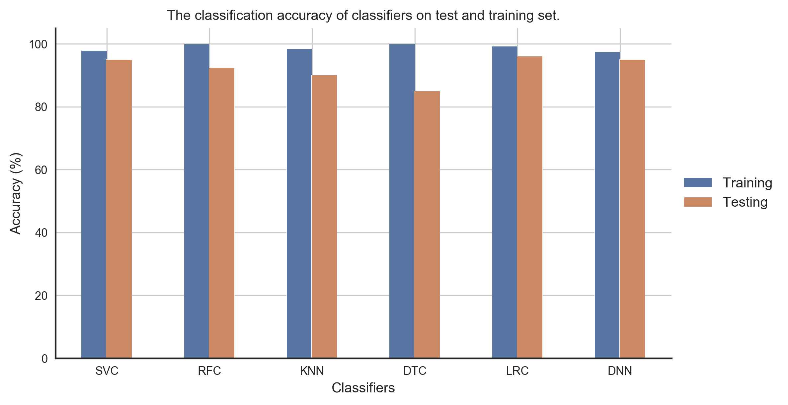

# Introduction
This article is brief summary of our paper on "[Adversarial Transferability in 
Wearable Sensor Systems](https://arxiv.org/pdf/2003.07982.pdf)." In this work we, 
have explored the topic of adversarial transferability from viewpoints that 
we believe are novel have not been discussed yet. But before we present our results 
and findings, let’s first understand a few topics and the framework of the paper.

# Adversarial Transferability
For the uninitiated, adversarial transferability captures the ability of adversarial 
examples that makes them transfer between independently trained models of different 
architectures. In almost all works on adversarial transferability, 
the discussion is usually carried out from the perspective of models. We believe 
in understanding adversarial transferability fully, and in uncovering the reasons 
behind their existence in the first place, we need to consider other avenues such 
as the datasets that are used to train the machine learning models. To this end 
in our work. We have tried to explore adversarial transferability and give a 
comprehensive discussion that takes into account the model and the dataset with 
wearable sensor systems as a case study.

# Discussion
In this work, we have explored adversarial transferability from the following perspectives. 
1. Transferability between machine learning models

In this case, we have trained models of different architectures independently on the 
same training set and evaluated them on adversarial examples computed using the 
deep neural network. The dataset we have used consists of features extracted from 
the time-series signals from different sensors for human activity recognition.
Figure 1 shows the training and test set accuracy of different classifiers. Here
	- SVC: Support Vector Classifier
	- RFC: Random Forest Classifier
	- KNN: k-nearest neighbor Classifier
	- DTC: Decision Tree Classifier
	- LRC: Linear Regression Classifier
	- DNN: Deep Neural Network

<figure>
  
  <figcaption>Figure.1 - Classification accuracy of different classifiers on test and training set of the UCI feature dataset.</figcaption>
</figure>

Now for the untargeted and targeted (with target class sitting) adversarial examples
computed using the DNN model, the misclassification rate and the success rate of the 
adversarial examples on these classifiers are shown in figure 2 and figure 3 
respectively.

 

# Conclusion