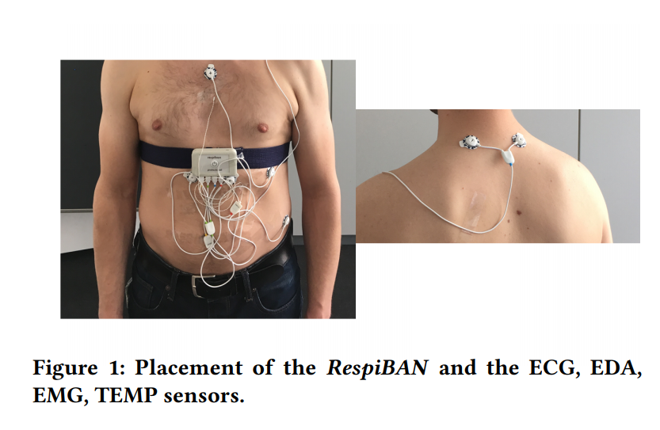

# Introduction
Stress detection and classification from physiological data is a promising direction towards assessing general health of
individuals and also in crucial health and social conditions such as alcohol use disorder. In the past few months, I have been working
on a project to detect moments of stress in individuals suffering from alcohol use disorder and creating a embedded mobile health care
system that can provide suggestions and interventions in real-time to prevent people from relapsing. Toward that end, we have collected physiological data 
including Electrodermal Activity (EDA) or Galvanic Skin Response (GSR), Accelerometer, Skin Temperature, and Heat Rate (HR). Because of the nature of the stress phenomenon
our dataset is highly imbalanced and also we have high doubts about the validity of the labels for stress class. 

Transfer learning is a learning paradigm that utilizes knowledge learned from one task to solve or learn mappings from input to outputs for another task in same or different
domain. One way to deal with problems associated with our dataset is to use transfer learning. In that light, I read many papers on stress detection and classification that uses
EDA data. For our project we want to use only the EDA data to detect moment of stress because EDA is established to be highly linked with stress and affects of stress. Searching for 
publicly available datasets for stress classification, I was largely dissappointed because most of the ealier research work in this field have not made their code and dataset public. After months of search I found only three datasets for stress classification that contained EDA data from Empatica E4 wrist-band. In this article, I want to present these datasets and list out their main propertise. My hope is that this article will save a lot of time for anyone who wants to explore this area of machine learning and health care.

# WESAD: Multimodal Dataset for Wearable Stress and Affect Detection
[WESAD]{https://ubicomp.eti.uni-siegen.de/home/datasets/icmi18/} is a publicly available dataset for wearable stress and affect detection. This multimodal dataset contains physiological and motion data, recorded from a Empatica E4 wrist-band and a chest RespiBan sensor of 15 subjects during a lab study. The sensor madalities are: blood volume pulse (BVP), electrocardiogram, electrodermal activity, electromyogram, respiration, body temperature, and three axis acceleration. The dataset contains data for three affective states: neutral, stress, and amusement. Figure below shows the placement of the sensor devices. 

  
  <figcaption align="center">Figure.1 - Placement of sensors on the human body for the WESAD dataset.</figcaption>

- For the chest sensor all sensor modalities were sampled ata 700 Hz.
- For the Empatica E4 BVP is sampled at 64 Hz, EDA at 4 Hz, skin temperature at 4 Hz, and accelerometer at 32 Hz. 
- A 20 minute baseline or neutral condition was recorded for each participants and for the amusement state the participants watched a set of eleven funny video clips. The amusement condition had a length of 392 seconds. 
- For the stress condition the participants were exposed to the Trier Social Stress Test (TSST), which consists of a public speaking and a mental arithmetic task. 
- The amusement and stress conditions wre followed by a guided meditation to de-excite the participants and bring them back to a close to neutral affective state. 

More detail about the dataset and machine learning model trained on the dataset can be found [here]{https://www.eti.uni-siegen.de/ubicomp/papers/ubi_icmi2018.pdf}.

# Loughborough University Multimodal Emotion Dataset-2
[LUMED-2]{https://figshare.com/articles/dataset/Loughborough_University_Multimodal_Emotion_Dataset_-_2/12644033} datset was collected from 13 participants with audio-video stimuli of 8 minutes 50 seconds. Short video clips were shown to elicit specific emotions: sad, neutral, and happy and a 20 seconds gray screen was shown to let the participants rest. After each session, the participants were asked to label the clips with the felt emotional state while watching them. The facial expressions of the participants were captured using a webca, at a resolution of 640 X 480 at 30 frames per second. Participants EEG data was captured with 8 channels at 500 Hz and Empatica E4 was used to measure other modalities. More detail about the dataset can be found [here]{https://ieeexplore.ieee.org/stamp/stamp.jsp?tp=&arnumber=9195813}.

# The SWELL Knowledge Work Dataset for Stress and User Modeling research
[SWELL]http://cs.ru.nl/~skoldijk/SWELL-KW/Dataset.html} dataset was collectef in an experiment, in which 25 people performed typical knowledge work (writing report, making persentations, reading e-mail, searching for information). The working conditions of the participants were manipulated with stressors such as email interruptions and time pressure. A varied set of data was recorded: computer logging, facial expressions from camera recordings, body postures from a Kinect 3D sensor and heart rate and skin conductance from body sensors. The participants subjective experience on task load, mental effort, emotion, and perceived stress was assessed with validated questionnaires as a ground truth. Empatica E4 was used to record the skin conductance and heart rate. More details about the dataset can be found [herr]{https://dl.acm.org/doi/10.1145/2663204.2663257}.