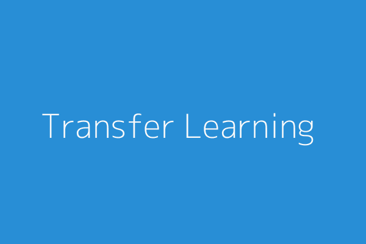

There are different types of learning paradigms and subgroups in machine learning. One of them is Transfer Learning. Transfer learning lends itself as one of the most useful and versatile methods of training machine learning models.

In transfer learning, we basically transfer knowledge learned from solving/learning one task to another task. For example, a model trained to detect physical activities can be used to detect moments of stress or cravings. An image classification model trained for cat vs. dog classification can be utilized for tumor detection. Obviously, using a model trained for one task to solve another problem is not straightforward and there are some steps we need to complete to make that possible.

The basic pipeline for transfer learning is (considering neural networks):

1. Freeze the layers of the base model to prevent weight and bias updates.
2. Add new layers on top of the base model to get a modified model.
3. Train the modified model on the problem dataset.
4. Evaluate the modified trained model and if needed fine-tune the model by unfreezing the base layers and training on the problem dataset with a very low learning rate.

We can avoid unnecessary computations in training by creating a new problem dataset. Pass the complete problem dataset to the base model and extract the model output just before the last layer. Use these outputs to train a new model for your respective problem. But there are some caveats, as you must have guessed by now.