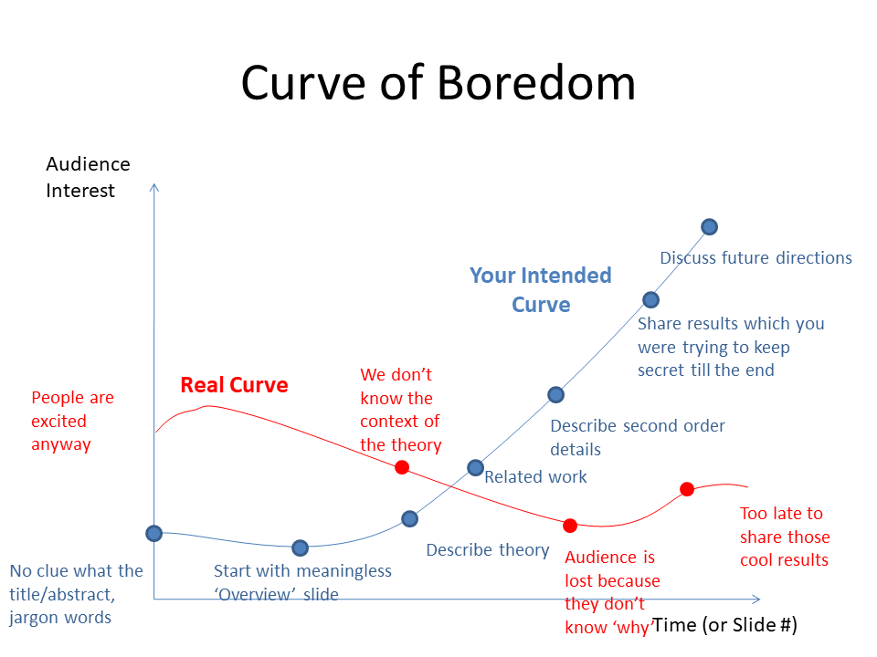
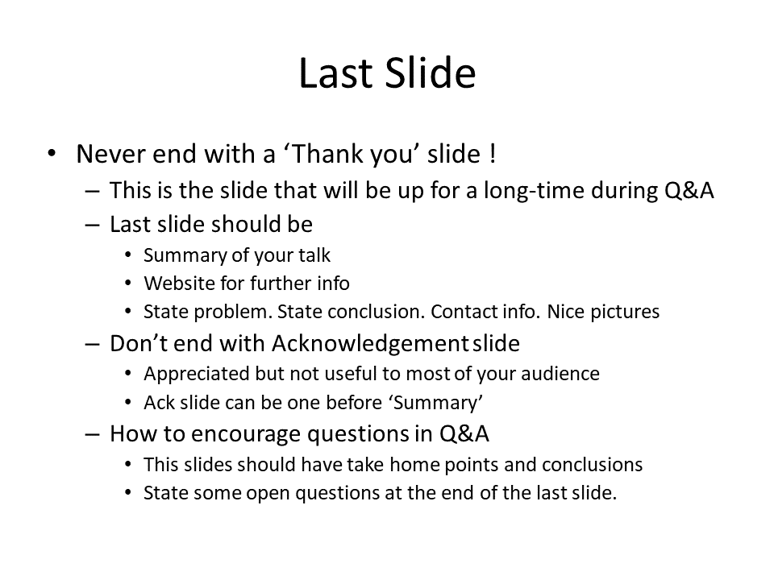

I discovered an excellent presentation on giving a presentation that doesn't put the audience to sleep. Fun right... :grin:

If you feel like shooting to the presentation here is the [link](https://www.slideshare.net/cameraculture/how-to-give-a-good-talk).

>I found myself guilty of all the errors mentioned in this talk. I always start with an overview slide and end with a thank you slide. What a waste it has been :roll_eyes:

Here are the main takeaways extracted from the presentation.

1. Don't start with an overview slide, instead pose a question or motivating example.
2. Give a glimpse of the results and make the audience wonder how you will get there.
3. Motivate the context or application and tell them why what you are doing is important.
4. The overview diagram of the project should be at the beginning and not at the end.
5. Always have a figure on each slide. The image doesn't have to be related to the content on the slide.
6. Never end with a thank you slide. This slide will remain on the screen for the Q&A and should be useful.
7. Use the last slide to summarize your talk, give more resources, pose questions, list take-home points, and open problems.

The slides belong to Ramesh Rasker of MIT Media Labs. Cheers! :green_heart: